# Instalación de un servidor SMTP en Windows Server 2016.

## Parte 1: Servicio SMTP

### Instalación de los roles del servidor.

En el panel de administrador del servidor Windows 2016 agregamos el rol de **Servidor SMTP** para que nuestro servidor de Windows pueda servir como servidor de correo.

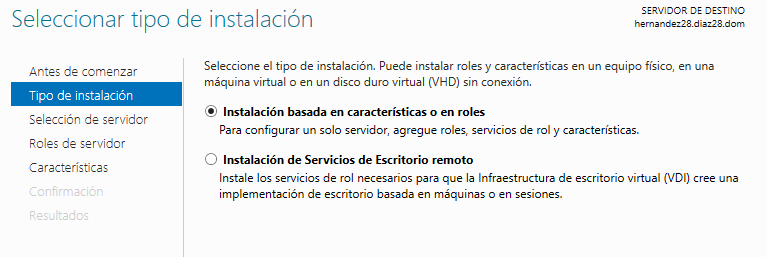

### Adición de registros DNS.

Debemos de añadir un nuevo campo dentro del DNS que vayamos a usar que se llamará **mail**, dentro de este debemos de crear 2 elementos:

* Un host que esté asociado a la ip del servidor (host server).
* Un alias que represente al host server (www).

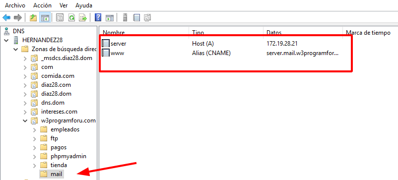

Dentro de la herramienta de Administracion d IIS 6.0 debemos de acceder a las propiedades del registro como se muestra en la imagen y ahí empezaremos a cambiar algunos parámetros.

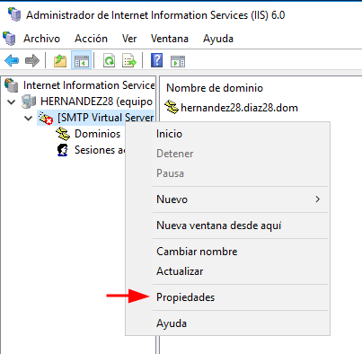

Habilitamos un par de opciones de registro para el servidor SMTP, como por ejemplo:
* Fecha del mesaje.
* Hora del mensaje.
* Nombre del usuario que mando el mensaje.
* Nombre del servidor que redirige el mensaje.

Aqui podemos cambiar el lugar donde se guardan los logs en el apartado de **Directorio del archivo de registro**.

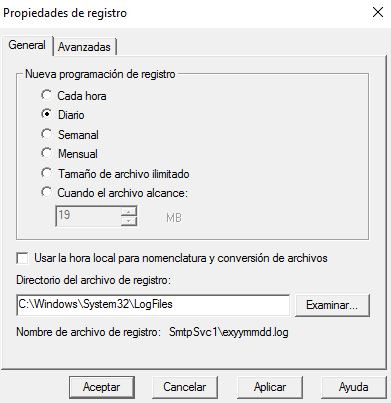

Ahora debemos de poner como direccion IP todas las asignadas, pero como no se da la opción por defecto de ponerla entre las opciones recomendadas y no se puede añadir se deja en **Todas las no asignadas**, además de esto el formato del registro lo configuramos como W3C y limitamos las conexiones a 50 con un tiempo de espera máximo para la conexion de 10 minutos.

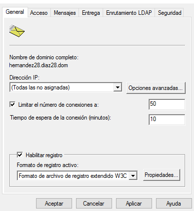

Enviamos una copia de informe de no entrega a una maquina externa del servidor y limitamos el tamaño de los mensajes a 2048 KB. Además podríamos cambiar el directorio de correos erroneos en el apartado de **Directorio de correo con errores**.

Habilitamos además el acceso anónimo.

Comprobamos en **C:\inetpub\mailroot** que se han creado las carpetas asociadas a cada uno de los tipos de correos.

* Badmail (Destinatarios desconocidos)
* Drop (Mensajes entregados)
* Pickup (Mesajes en cola para **usuarios no** miembros del servidor)
* Queue (Mesajes en cola para miembros del servidor)

Comprobamos la existencia y conexión con el registro DNS que creamos antes desde el cliente.

### Configuración del cliente mail pegasus mail

Accedemos a la página de descargas de [Pegasus Mail](http://www.pmail.com/downloads_s3_t.htm) y descargamos el más reciente de los clientes de Pegasus para Windows.

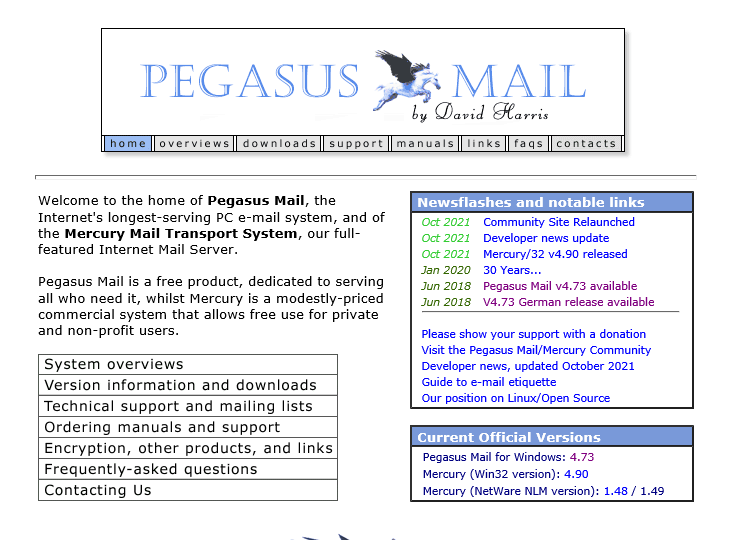

Cuando abrimos el ejecutable nos salen las siguientes pantallas que iremos configurando con las opciones por defecto (en la mayoría de ellas).

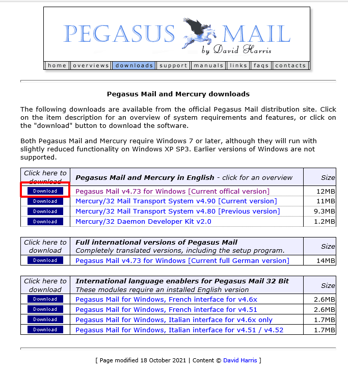

Se puede cambiar el directorio base de Pegasus Mail

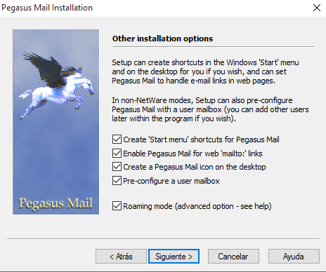

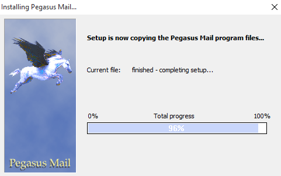

Cuando terminamos la instalacion se nos abre en el explorer de windows la siguiente pestaña en la que se encuentrar las herramientas de configuración de Pegasus Mail. Abrimos **Pegasus Mail as 'Admin'**

Ahora debemos de configurar a nuestro gusto el cliente de correo Pegasus

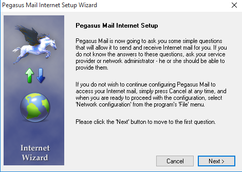

Introducimos nuestro correo.

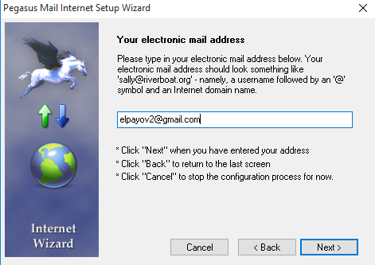

Introducimos el nombre de maquina del Servidor.

Agregamos un usuario del servidor.

Agregamos la ip del servidor.

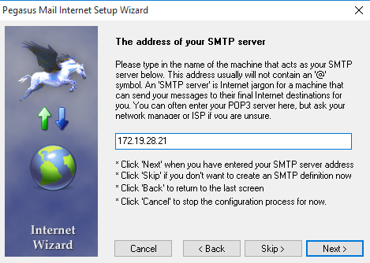

Podemos especificar si queremos conectarnos mediante un Modem o mediante broadcast a la red.

Ahora debemos de configurar las opciones de internet dentro del propio correo. Para ello accedemos a **Tools → Internet Options→ Sending (SMTP) → Add** (siguientes 4 imagenes representan como añadir un servidor de reenvio smtp).

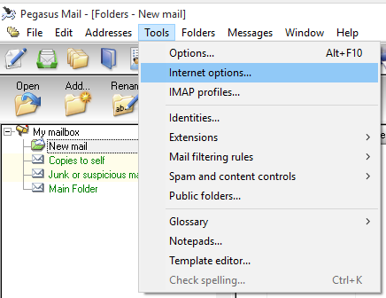

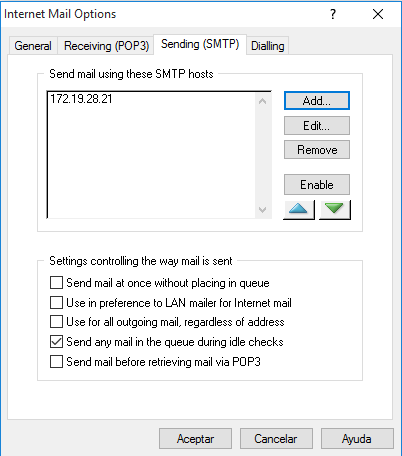

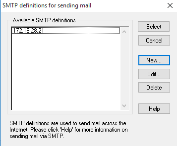

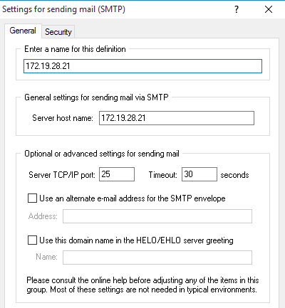

Ahora intentaremos enviar un correo a un usuario llamado marco con correo **marco@diaz28.dom**

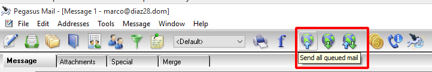

Nos da un error de conexión

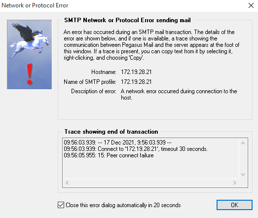

Si intentamos enviar un correo de nuevo con CC (Carbon Copy) añadido para recibir una copia del mensaje.

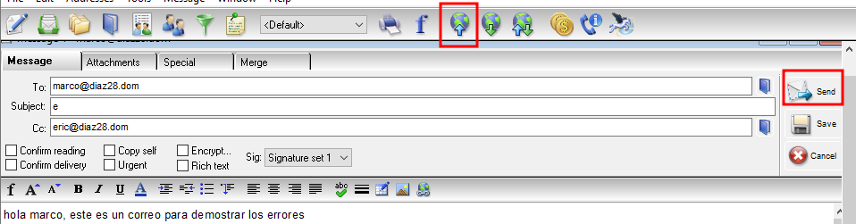

Vemos que nos da un error asociado a la autenticación del servidor SMTP

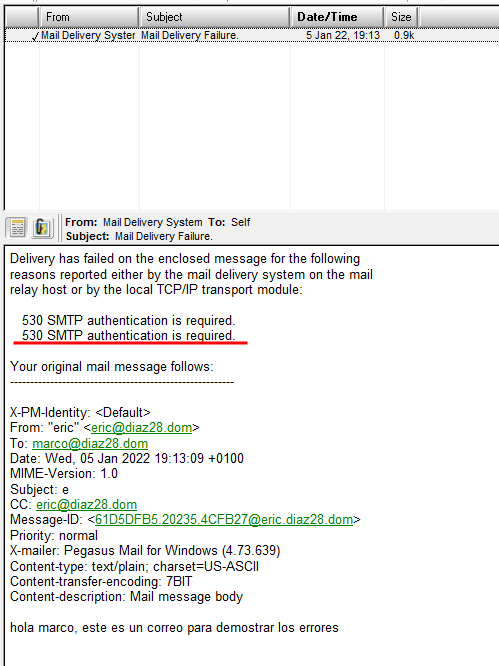

Faltaron los puntos:

* Enviar varios correos desde / hacia las diferentes cuentas y comprobar envío (real o ficticio) y carpetas mailroot. Las carpetas existentes en mailroot alojan mensajes en cola (Queue), mensajes para destinatarios desconocidos (Badmail) y mensajes entregados (Drop)

* Nueva configuración de servicio SMTP a través del administrador de aplicaciones (IIS) 6.0. Establecer autenticación básica de Windows. Probar diferentes configuraciones de dominio predeterminado, cifrado TLS, etc.
  * En el cliente Windows:
    * Configurar las cuentas según los parámetros especificados en el servidor. Enviar varios correos desde / hacia las diferentes cuentas y comprobar envío y carpetas mailroot. En este caso sólo tendrán acceso al servidor SMTP cuentas del dominio y correspondientes a usuarios de AD.

## Parte 2: Cliente Htmail

### Preparativos

Para poder realizar esta parte de la practica se debe de desinstalar en el servidor el rol de Servidor SMTP.

### instalaicon de Hmail

Vamos a la página oficial de [Hmail](https://www.hmailserver.com/) y descargamos

Ahora realizamos una instalacion estandar de los componentes de hmail server.

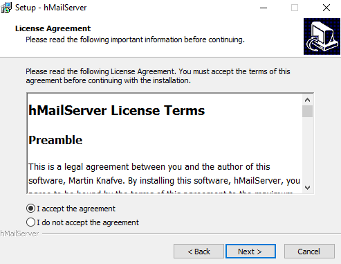

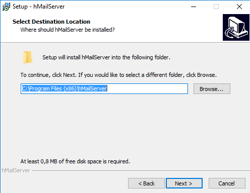

Usamos la base de datos que genera el propio programa.

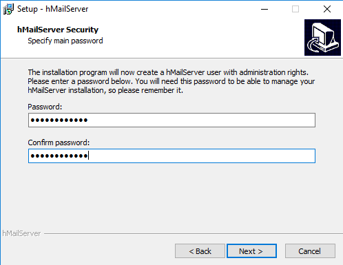

Es necesaria la instalación de **.NET Framework 2.0** en el servidor, aunque la instalemos desde el propio instalador de Hmail da errores, por lo que procedemos a instalarla desde el Panel de Administrador del Servidor.

Agregamos **.NET Framework 3.5** que contiene **.NET Framework 2.0**

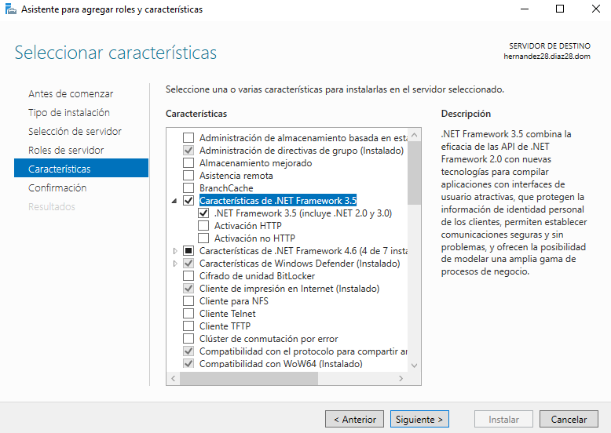

Realizamos la instalación de nuevo.

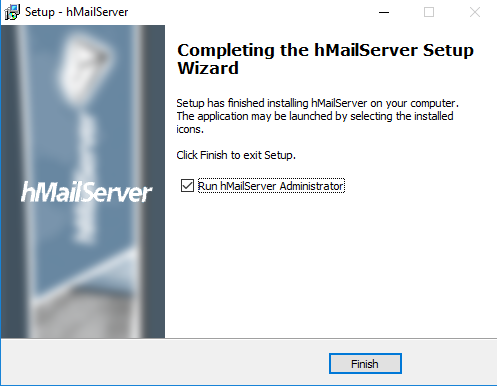

Ahora creamos 2 nuevos dominios en el DNS y cada uno debe tener un registro MX:
* **srd.edu**
* **asir.edu**

Entramos dentro de la utilidad Hmail e introducimos la contraseña.

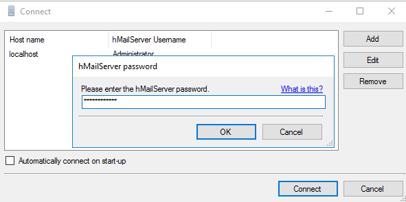

Ahora añadimos los 2 Dominios que creamos.

Ahora cambiamos donde se guardan las backups.

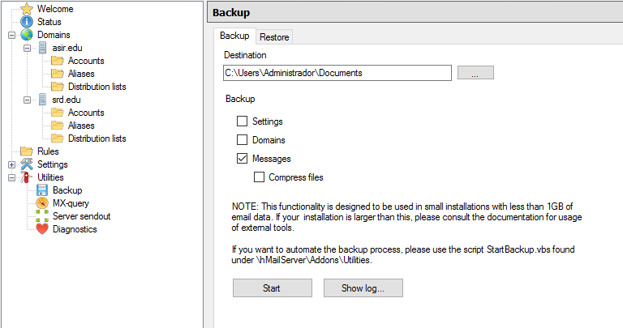

Creamos 2 usuarios para cada Dominio.

Configuramos una respuesta automatica para uno de los usuarios y una firma para el otro

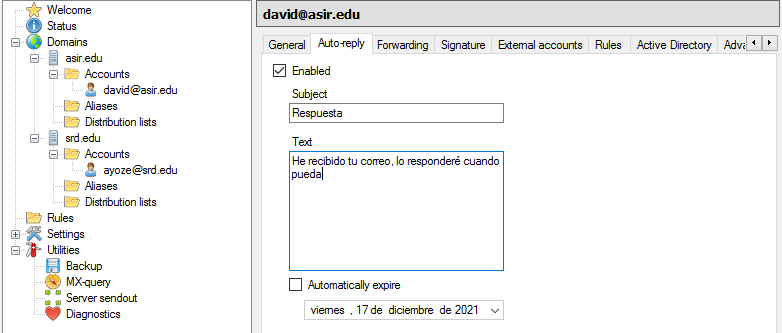

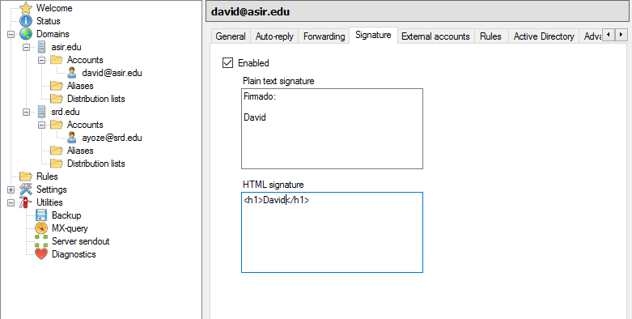

Ahora comprobamos que se hacen las Backups.

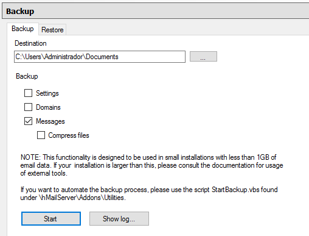

Hacemos un diagnóstico para cada uno de los dominios y fallan en los registros mx y las conexiones. Se consideró que el problema fuera que no estaba instalada la caracteristica de servidor SMTP, pero genera más problemas de los que aparecen, luego se consideró que el problema fuera que arriba a la derecha se tuviera que poner el registro mx o un alias de este para realizar el test, pero genera otros problemas diferentes.

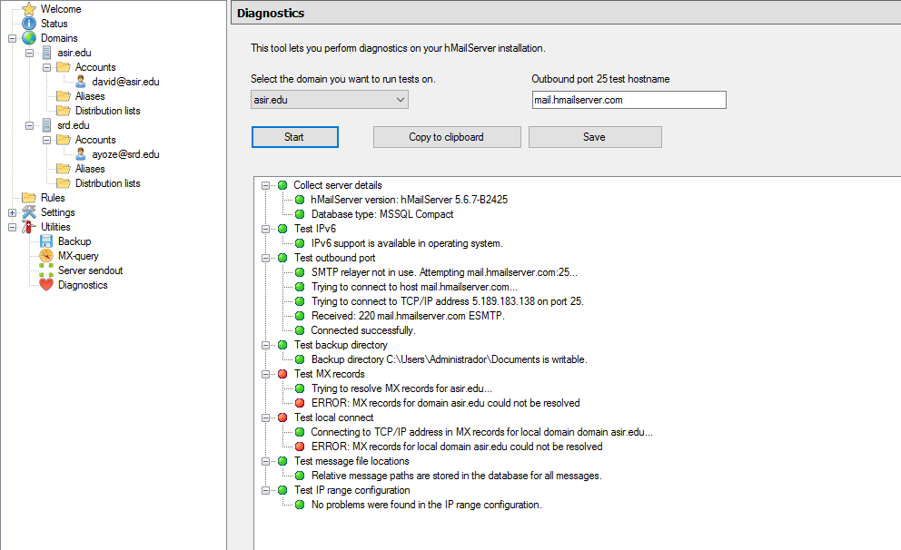

Faltaron los puntos:

* Configura en el cliente Windows un cliente de correo como thunderbird o Live Mail (en los ordenadores clientes) para acceder al servidor de correo instalado en Windows 2016.
* Realiza prueba de envío y recepción de correos entre los diferentes usuarios, comprobando, además de envío y recepción correctas, el efecto de las opciones configuradas en las cuentas.
* Crea una lista de distribución empleados asociada al dominio y añade a los dos usuarios de miempresa.com a ella.
Realiza prueba de envío y recepción de correos por medio de la lista de distribución.

Debido a que no se encontró una solución para el error de identificacion de registro tipo mx.
