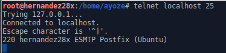
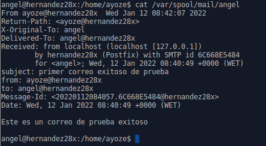

# Instalación de cliente de Correo en Linux

***Nombre: Ayoze Hernández Díaz***
***Curso: 2º de Ciclo Superior de Administración de Sistemas Informáticos en Red.***

### ÍNDICE

+ [Introducción](#id1)
+ [Objetivos](#id2)
+ [Material empleado](#id3)
+ [Desarrollo](#id4)
+ [Conclusiones](#id5)

#### ***Instalación de postfix***. 

Instalamos el postfix con el comando **sudo apt-get install postfix**.

Elegimos la opcion de sitio de Internet.

Definimos el nombre del sistema que vamos a usar para el servidor de correo.

Iniciamos el servicio de postfix con **sudo /etc/init.d/postfix start** (no aparece sudo en la imagen porque ya somos root).

Usamos el comando **netstat -utap** para ver las conexiones activas

Definimos un usuario angel y le añadimos contraseña.

Usamos **telnet localhost 25** para conectarnos dentro de la propia máquina para conectarnos al servicio de correo.

Ahora usamos:
* helo localhost para usar usuarios del sistema para enviar un correo.
* mail from: ayoze para especificar el usuario
* rcpt to: angel para especificar a que usuario se va a enviar.
* data para ver el correo y enviarlo.

Iniciamos sesión como angel y miramos el archivo de texto que se ha creado en **/var/spool/mail/angel**.

#### ***Instalación de Evolution***. 

Instalamos el cliente de correo evolution con **sudo apt install evolution** en el cliente.

Dentro del fichero **/etc/hosts** añadimos 2 registros asociados a la ip  del servidoren el cliente siendo estos:

* **smtp.w34u.com**
* **pop.w34u.com**

Abrimos el evolution para empezar a configurarlo (la mayoría de capturas van por defecto).

Definimos un usuario con cuenta de correo en el servidor.

Definimos el servidor para el servicio **pop**.

Definimos el servidor para el servicio **smtp**.

Intentamos enviar un correo de prueba.

Pero vemos que se nos queda colgado enviando el mensaje. (Probe a añadir usuarios desde el propio).

#### ***Instalación de Squirrelmail***. 

Aunque este componente sea del último apartado se debe de instalar en este porque lo requiere.

Instalamos el squirrelmail con **apt install squirrelmail**.

Vemos con tree lo que hay en la carpeta de **/etc/squirrelmail**.

Copiamos el fichero de configuración de apache dentro de /etc/squirrelmail a /etc/apache2/sites-available.

Vemos el estado del servicio y luego lo reiniciamos.

Hacemos un enlace simbólico en **/etc/apache2/sites-enable**

Habilitamos el sitio con **a2ensite squirrel.conf**.

Comprobamos el estado del apache2.

Entramos **localhost/squirrelmail**

Cuando entramos con uno de los usuarios mostrados a continuación:

* Roberto
* Fernando

Devuelve el siguiente error.

Busque información sobre como arreglar el error y decia de añadir a los usuarios al grupo mail, cosa que no funcionó. Puedo acceder a diferentes INBOX, pero no al que interesa.

INBOXES ACCESIBLES

* Borradores
* Enviados
* Papelera

