

# TÍTULO DE LA PRÁCTICA

***Nombre:*** Angél David González Quintana y Ayoze Hernández Díaz
***Curso:*** 2º de Ciclo Superior de Administración de Sistemas Informáticos en Red.

### ÍNDICE

+ [Comprobaciones previas](#id1)
+ 
+ 
+ 
+ 

#### ***Comprobaciones previas***. 
Para la practica necesitaremos los servicios y utilidades de:

* **Apache2**
* **Php**
* **PhpmyAdmin**

Comprobamos que tenemos los componentes instalados.

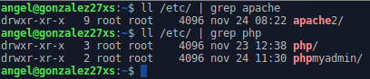

#### ******. 

Descargamos el paquete de **phplist**.

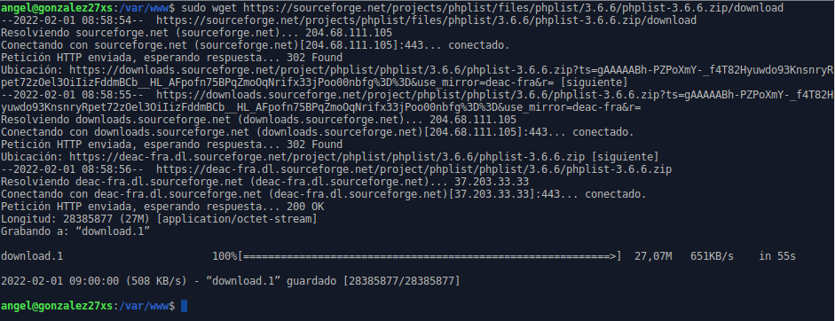

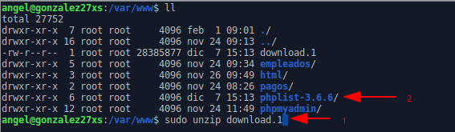

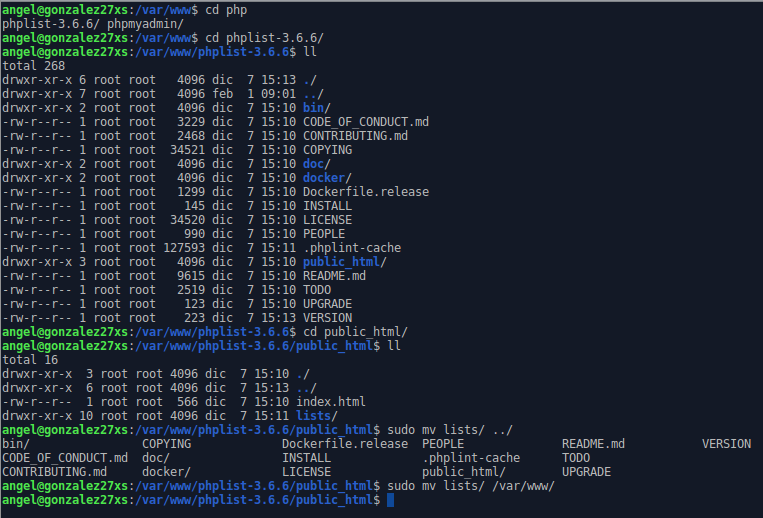

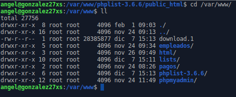

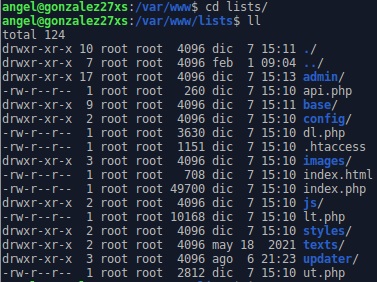

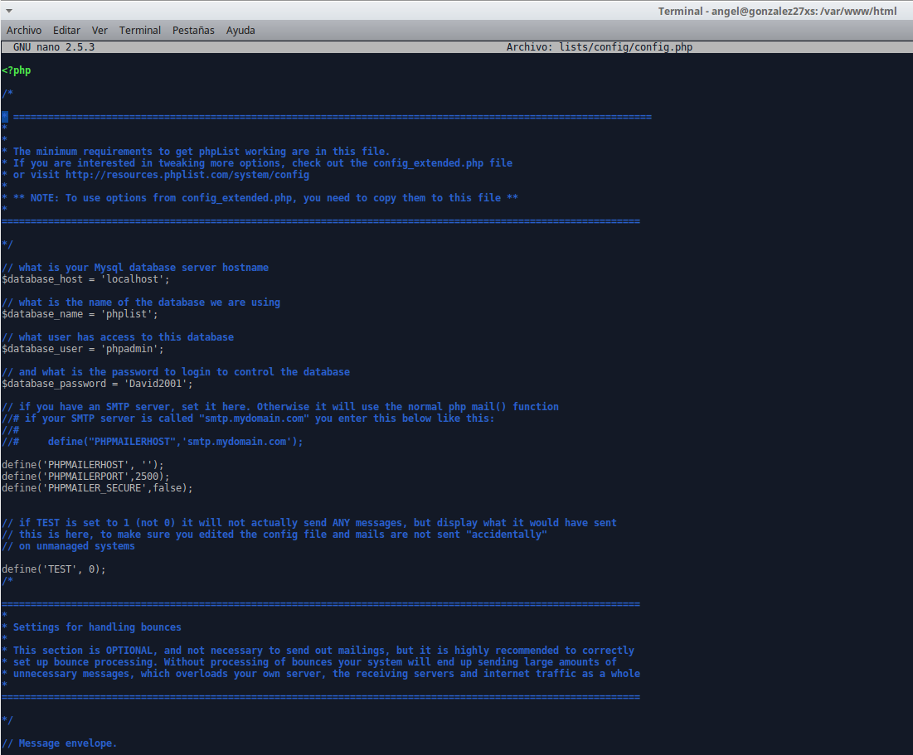

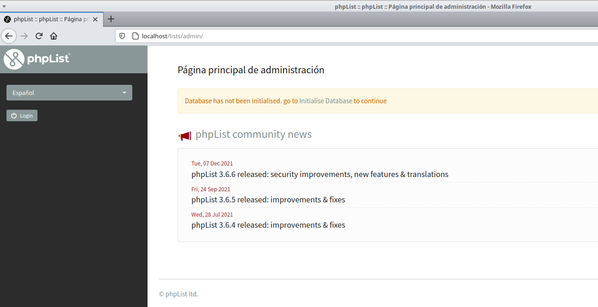

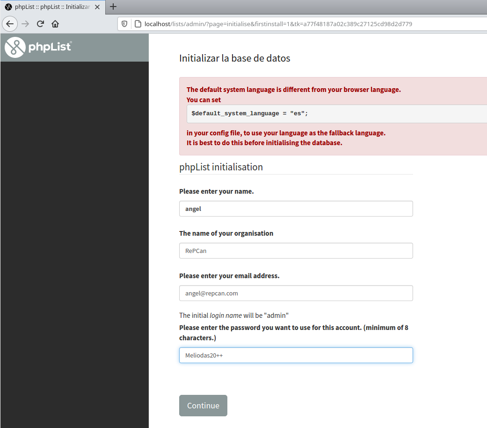

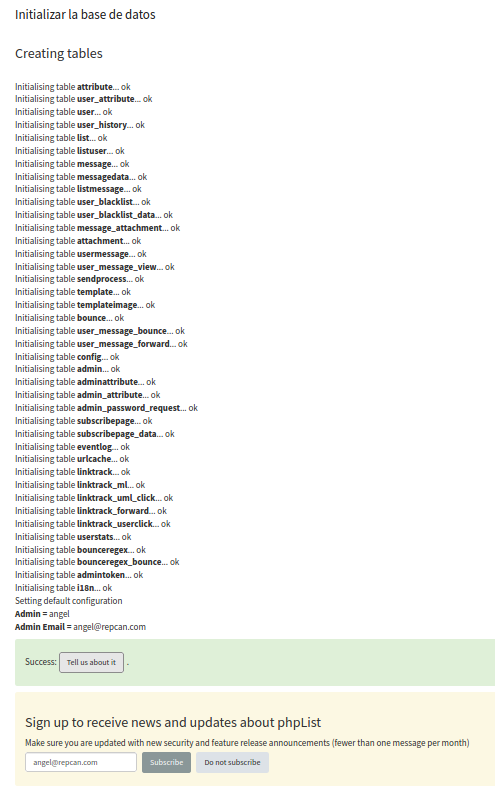

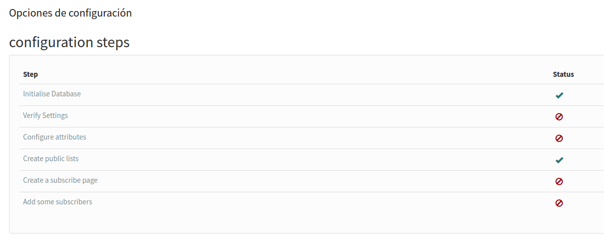

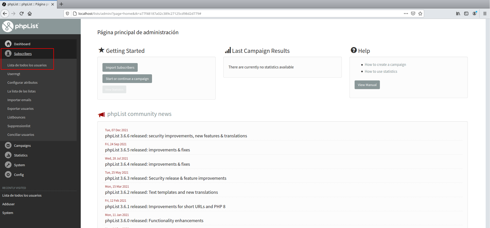

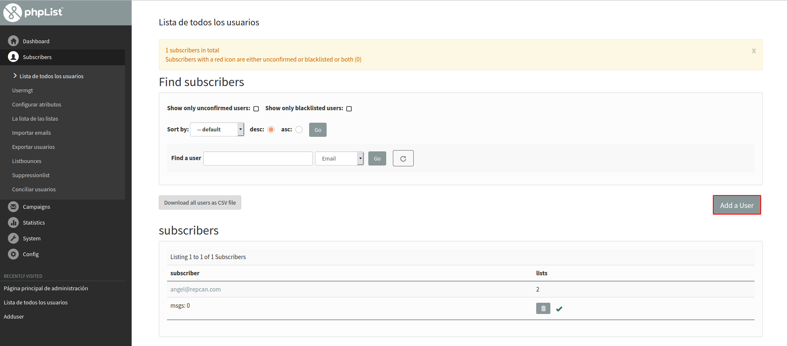

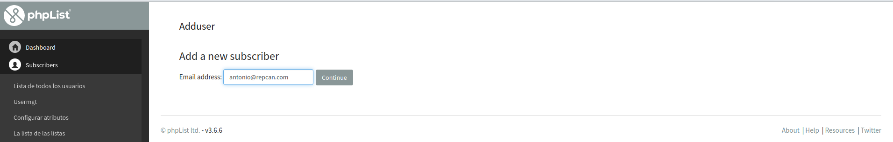

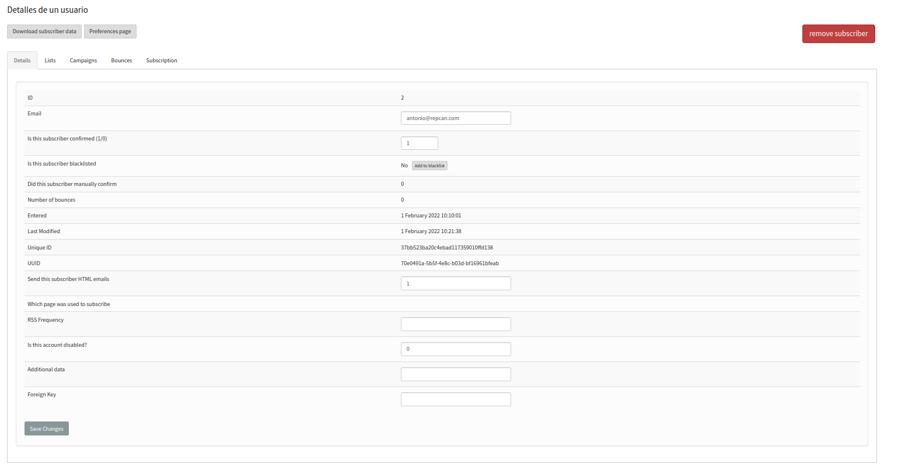

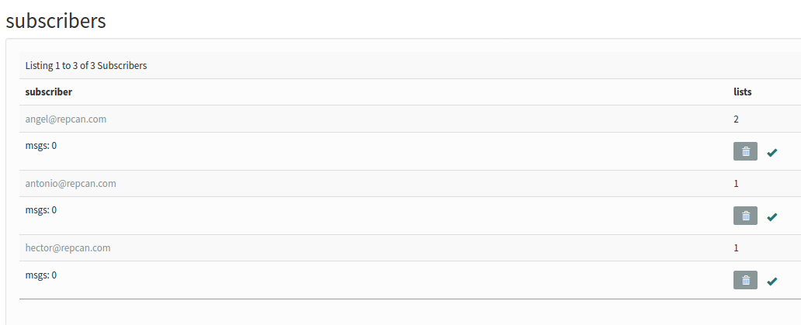

#### ******. 

#### ******. 

#### ******. 
