<center>

# Servidor de Streaming en Windows Server 2016.

</center>

***Nombre:*** Ayoze Hernández Díaz
***Curso:*** 2º de Ciclo Superior de Administración de Sistemas Informáticos en Red.

### ÍNDICE

+ [Instalación](#id1)
+ [Comprobar](#id2)
+ [Carpeta personalizada](#id3)

#### ***Instalación***. <a name="id1"></a>

En el panel de administrador del sistema vamos a **Agregar roles y características**.

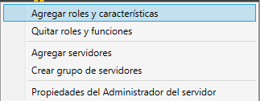

Debemos de tener el rol de Servidor web (IIS) instalado de manera básica.

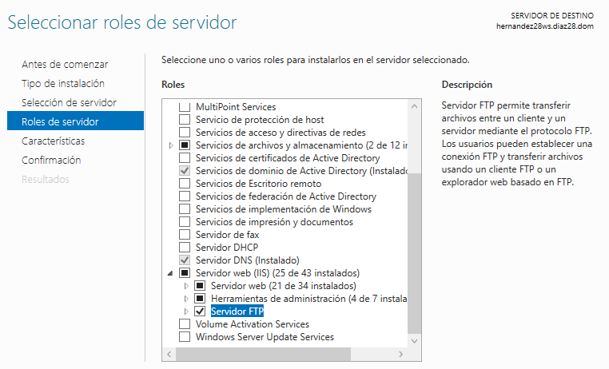

Nos vamos a la página de [umediaserver](umediaserver.net) y descargamos el paquete de instalación.

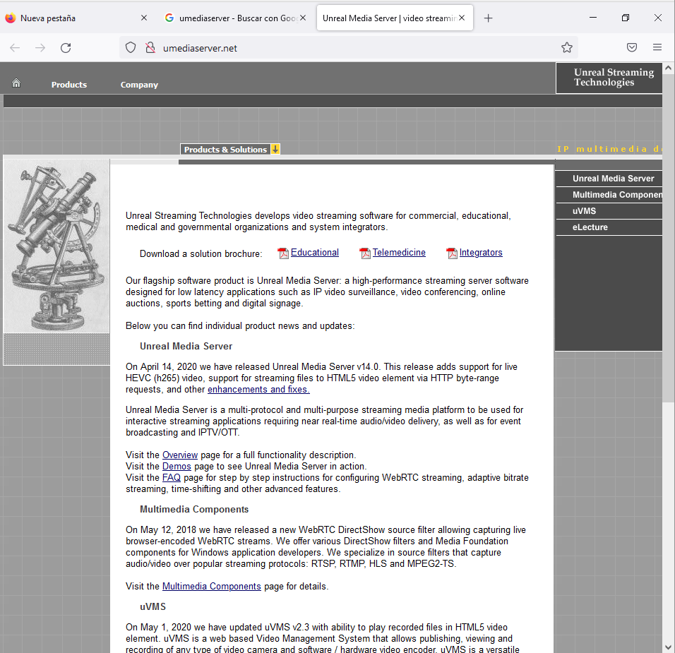

Ejecutamos el archivo y configuramos el servicio con las opciones por defecto.

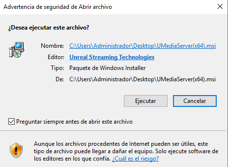

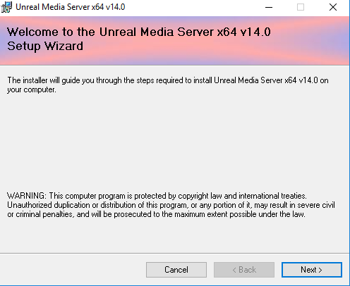

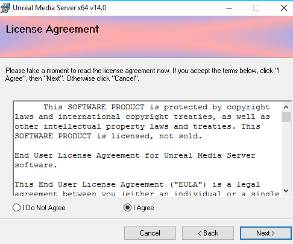

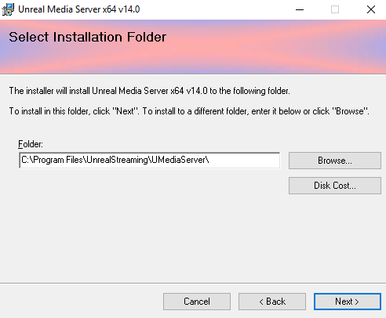

#### ***Comprobar***. <a name="id2"></a>

Abrimos el servicio y lo iniciamos.

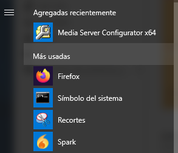

Intentamos abrir uno de los videos de prueba (test.avi) mediante el navegador con una url similar a ```mms://172.19.28.21:5119/MediaRoot/test.avi```.

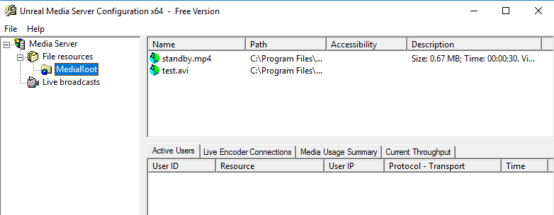

Ahora debemos de elegir un reproductor que abra la url, en mi caso el reproductor de Windwos media.

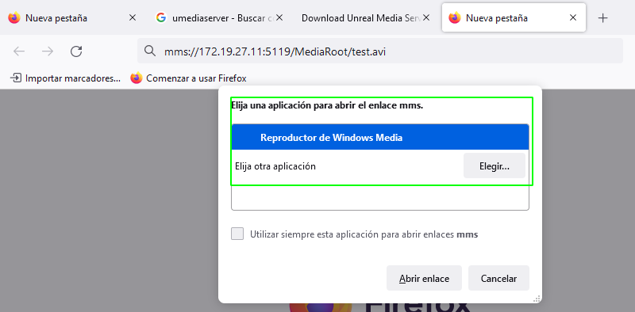

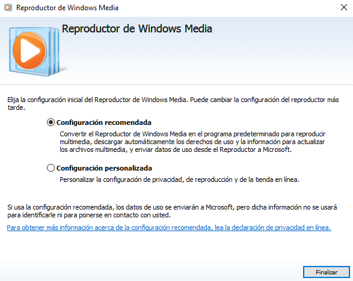

Como no pude abrir el video al primer intento intento abrir elejecutable de nuevo y da un error que apare brevemente y dice que tenemos que asegurarnos de tener instalada la característica de Media Foundation en nuestro servidor por lo que debemos de instalarla, ahora si podemos abrir la url.

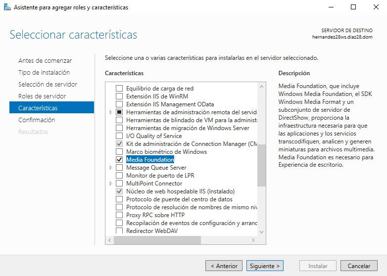

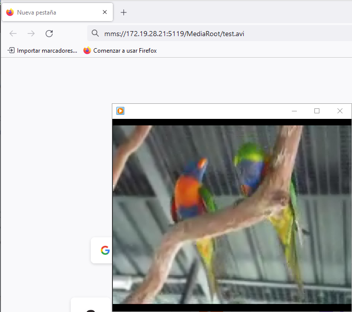

#### ***Carpeta personalizada***. <a name="id3"></a>

Añadimos una carpeta personalizada en la que vamos a tener varios archivos que podamos poner en streaming.

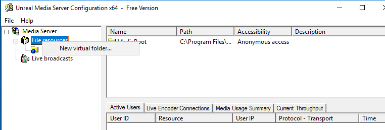

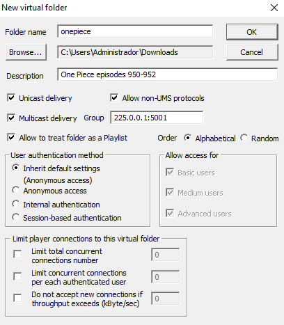

Abrimos con vlc para variar.

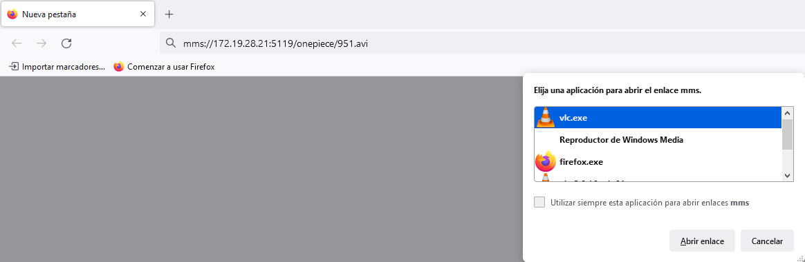

El video se pudo reproducir, pero solo el audio, cada vez que lo intentaba solo oía el audio del vídeo.

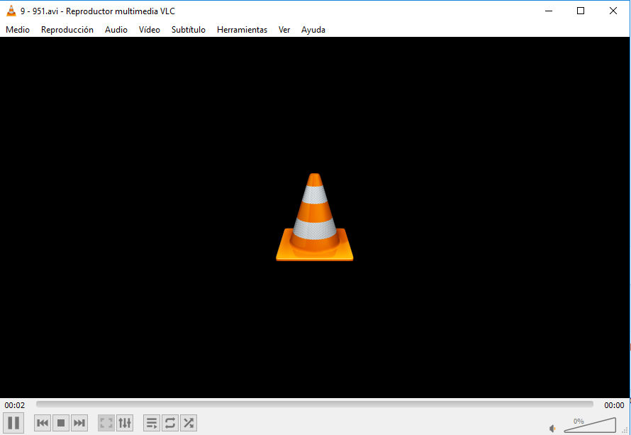
