<center>

# Servidor de Steaming en Linux

</center>

***Nombre:*** Ayoze Hernández Díaz
***Curso:*** 2º de Ciclo Superior de Administración de Sistemas Informáticos en Red.

### ÍNDICE

+ [Requisitos](#id1)
+ [Instalación de Icecast2](#id2)
+ [Configuración](#id3)
+ [Instalación de Ices2](#id4)
+ [Comprobar](#id5)
+ [Errores](#id6)

#### ***Requisitos***. <a name="id1"></a>

Para realizar esta práctica necesitamos disponer de los siguientes elementos:

* Sistema operativo Ubuntu/Debian
* Conexión a internet
* Archivos con los que hacer streaming (.odd en mi caso)

#### ***Instalación de Icecast2***. <a name="id2"></a>

Instalamos la herramienta de Icecast2 con el comando ```sudo apt install icecast2```.

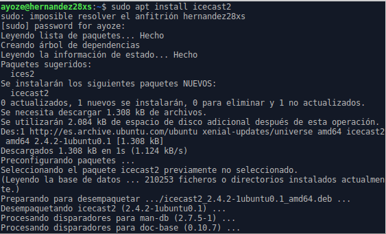

Ahora debemos de configurar el servicio con las opciones abajo dispuestas (en mi caso elegí las opciones por defecto).

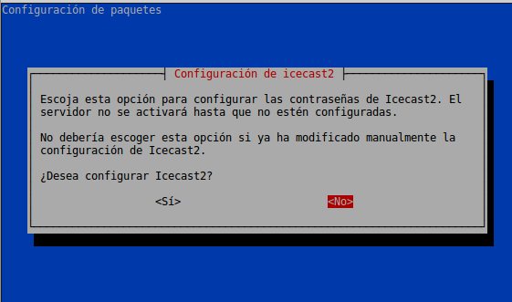

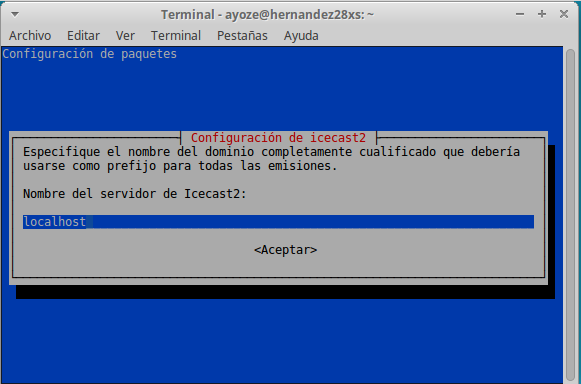

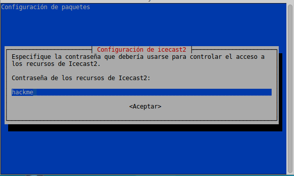

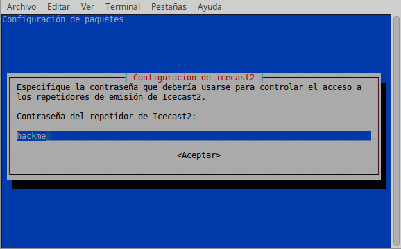

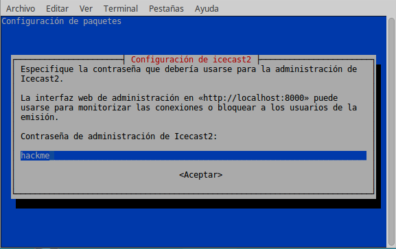

#### ***Configuración***. <a name="id3"></a>

Editamos el fichero ```/etc/icecast2/icecast.xml``` y vemos que en el apartado marcado abajo aparecen las contraseñas.

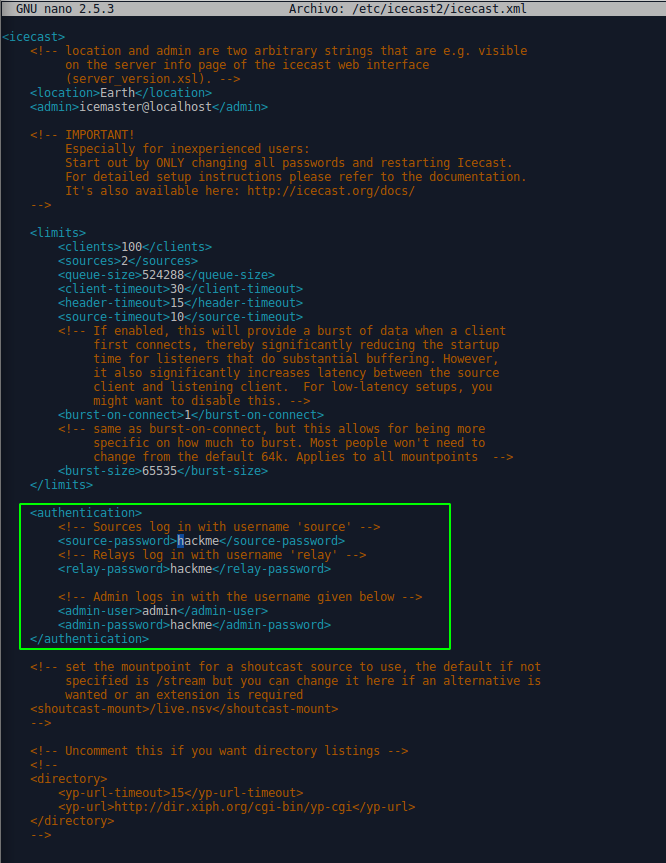

Nos aseguramos que en el fichero ```/etc/default/icecast2``` esté activada la última línea:

* **ENABLE=true**

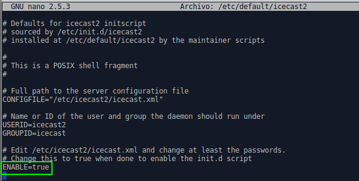

Activamos e iniciamos el servicio.

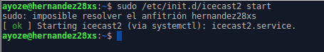

##### ***Instalación de Ices2***. <a name="id4">

Instalamos el servicio de ices2 con ```sudo apt install ices2```.

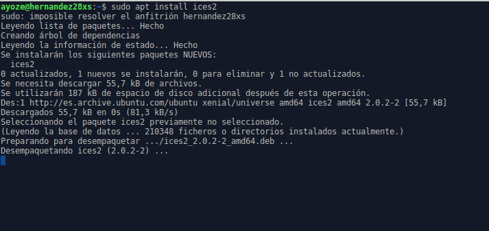

Copiamos el contenido de ```/usr/share/doc/ices2/examples/ices-playlist.xml``` a ```/etc/ices2```.

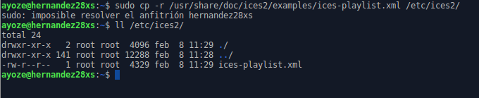

Y editamos en la sección de stream para que tenga algo distintivo.

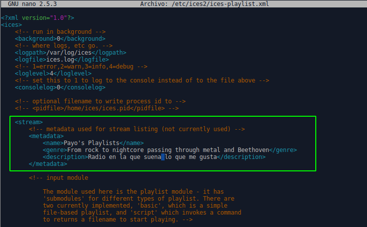

Podemos editar la manera de acceso a nuestro servidor de streaming en el archivo ```/etc/ices2/ices-playlist.xml```. <a name="error"></a>

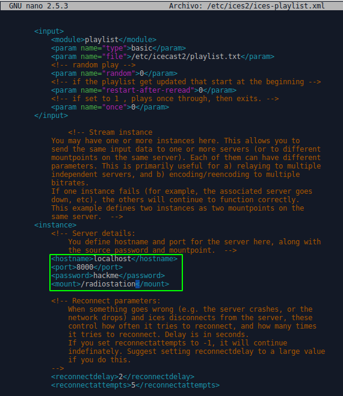


#### ***Comprobar***. <a name="id5"></a>

Creamos la carpeta musica en **/tmp**.

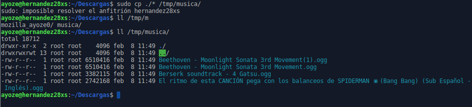

Ahora buscamos la música que hallamos descargado en el sistema y la incorporado dentro del archivo ```/etc/icecast2/playlist.txt```.

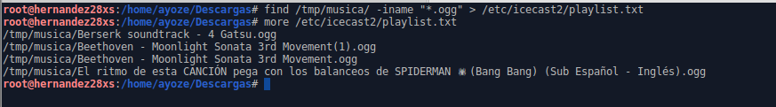

Ahora activamos el servidor de streaming con el comando **sudo ices2 /etc/ices2/ices-playlist.xml &**.

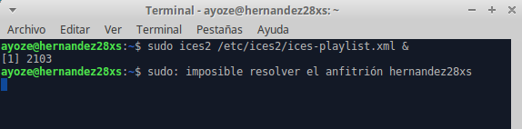

Accedemos a nuestro servidor de streaming por la url **localhost:8000/admin/** e introducimos los datos por defecto que nos pida y accedemos.

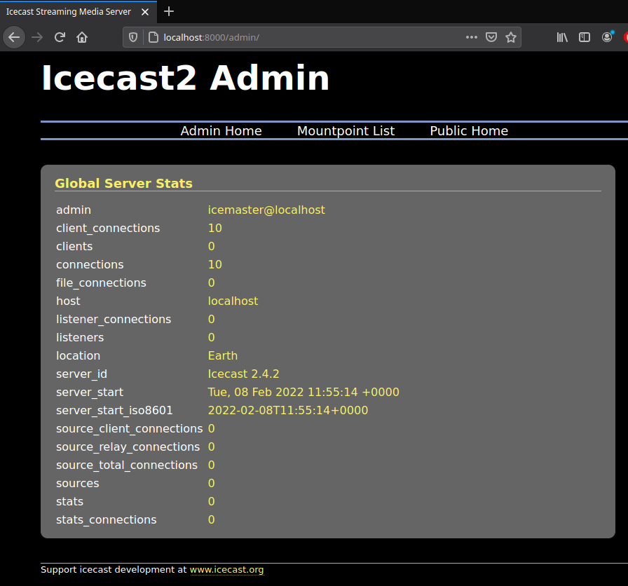

#### ***Errores***. <a name="id6"></a>

Habiendo consultado y revisado con varios compañeros los ficheros de configuración, tanto los suyos como los mios hemos llegado a la conclusión de que no sabemos que es lo que está fallando ya que los ficheros de configuración míos y los de los compañeros están configurados de la misma manera o similar y su servidor de streaming funciona y el mío no.

Lo que si se puede hacer con mi servidor es acceder a él pero no se puede acceder al mountpoint de radiostation. (también se ha probado a cambiar el apartado de mount en esta [imagen](#error))
